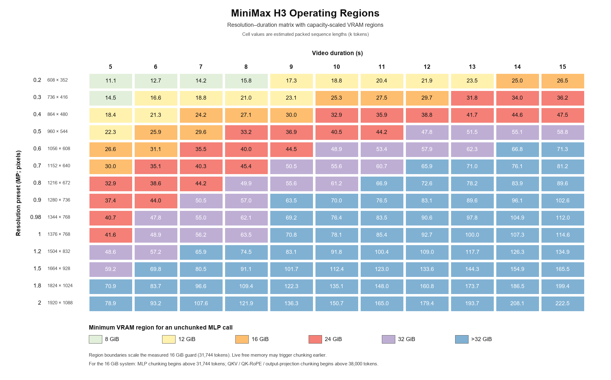

# H3_V100

[简体中文](README_zh-CN.md) | English

`H3_V100` is a ComfyUI optimization node for MiniMax H3 on NVIDIA Tesla V100
(SM70). Version 1.4.1 freezes the validated precision, memory, and weight
policies as a stable profile and simplifies the workflow UI.

The node patches only the cloned `MODEL` passed through it. It does not modify
ComfyUI or other custom-node files, and it rejects model layouts other than the
validated 50-block MiniMax H3 implementation.

## Stable built-in policy

- ComfyUI Dynamic VBAR is the sole owner of compressed-weight residency; no
  second INT8 GPU staging path is installed.
- Inactive prior-stage CUDA Dynamic models are detached before H3 sampling.
- An inactive node-managed H3 model is detached before the next prompt loads
  its text encoder, preventing repeat-run AIMDO VBAR copy aborts.
- FP32 is retained for residual-sensitive, text-prepath, and audio-query work;
  validated QKV, main-attention, and MLP linear islands use FP16.
- Attention uses a fixed `/16` prescale restored in FP32 after the bias-free
  output projection.
- Scaled FP16 SwiGLU is always enabled: value branch `/16`, fc2 input `/8`,
  with the combined scale restored in FP32.
- MLP chunk size adapts to real driver-free VRAM. fc1/fc2 are prepared once per
  MLP invocation, reused by all activation chunks, then immediately released.
- Long-sequence QKV, Q/K Norm+RoPE, and output projection use bounded chunks.

## Node controls

| Control | Default | Purpose |
|---|---:|---|
| `mixed_precision` | On | Validated V100 FP16/FP32 split. |
| `attention_backend` | `flash_attn` | Exact Flash or explicit `sol_attn`. |
| `sol_tau` | `1.0` | Sol sparse threshold. |
| `sol_start_percent` | `0.2` | Sol schedule-window start. |
| `sol_end_percent` | `0.8` | Sol schedule-window end. |

## Launcher migration

The validated 16 GiB V100 profile uses ComfyUI's default DynamicVRAM:

```text
Do not add --disable-dynamic-vram
Do not add --lowvram
Do not add --fast fp16_accumulation
```

After removing old launcher arguments, fully restart ComfyUI and reload the
diffusion model. The node requires a Dynamic ModelPatcher and fails clearly
instead of silently selecting an unvalidated fallback.

## Install or upgrade

1. Stop ComfyUI.
2. Replace the complete old `H3_V100` folder with v1.4.1.
3. Confirm `comfy_v100_flash_attn_cuda.cp312-win_amd64.pyd` is present.
4. Update the launcher as described above and restart ComfyUI.

Do not stack another node that patches the same H3 attention, MLP, QKV, or
output-projection methods. If TE-Speed is used, place it before H3 V100.

## Requirements

The inherited v1.4.0 validation environment uses **one V100**. No model or VAE is
assigned to a second GPU:

| Component | Current validation configuration |
|---|---|
| GPU | 1 × NVIDIA Tesla V100 16 GiB (SM70); all CUDA work uses `cuda:0` |
| Placement | ComfyUI default DynamicVRAM management; no manual multi-GPU placement |
| H3 diffusion model | MiniMax H3 INT8/mixed-precision weights, demand-resident on `cuda:0` through Dynamic VBAR |
| Text encoder | MiniMax H3 text encoder runs on CPU; inactive Dynamic models are released before H3 sampling |
| Video/audio VAE | Managed by ComfyUI between the same `cuda:0` and CPU offload |
| LoRA | MiniMax H3 FL2V Turbo 8-step BF16 |
| Sampling | 8 steps, 24,792 packed tokens |
| Software | Windows x64, CPython 3.12, PyTorch 2.8.0, CUDA 12.8 |

A ComfyUI build with the expected MiniMax H3 and DynamicVRAM implementation is
required.

No additional pip package is required. The bundled `.pyd` is ABI-specific;
other Python versions and Linux are not supported by the current prebuild.

## Inherited v1.4.0 validation snapshot

The same 8-step, 24,792-token workflow produced:

| Route | State | First step | Displayed average | Full prompt |
|---|---|---:|---:|---:|
| Flash | Cold run | 63.85 s | 54.70 s/step | 563.77 s |
| Flash | Warm stable run | 54.66 s | 55.41 s/step | 490.84 s |
| Sol | Warm stable run | 54.7 s | about 54 s/step | 485.69 s |

All runs produced normal video and audio. Seeds and thermal state were not
controlled as a formal benchmark. These observations validate stable execution and the much
smaller cold/warm gap; they are not cross-system performance guarantees.

`flash_attn` is the exact route. `sol_attn` is an explicitly selected sparse
approximation and is used only inside its eligible sequence, block, and
diffusion windows. Flash never enters Sol implicitly.

## Limits

Resolution, duration, references, audio, other resident models, CUDA
fragmentation, and ComfyUI version all move the VRAM boundary. Start around
864x480 or 960x544 at 5-10 seconds and increase one dimension at a time. Very
long sequences remain runnable through smaller MLP/QKV chunks but may become
substantially slower.



| Tier | Resolution and duration examples | Guidance |
|---|---|---|
| Recommended | 0.2–0.5 MP at 5–10 s; 0.2–0.3 MP up to 15 s | Balanced detail, duration, and runtime. |
| Extended | 0.4–0.6 MP at 10–15 s; 0.7–0.9 MP at 5–8 s | More chunking and substantially longer runtime are common. |
| Extreme | Around 0.9 MP at 15 s, or most combinations above 1.0 MP | Validate a shorter duration first. |
| Not recommended | 1.5–2.0 MP at longer durations | OOM risk and runtime may be disproportionate. |

## References and acknowledgements

- [ComfyUI](https://github.com/Comfy-Org/ComfyUI) provides the model and
  execution framework.
- The sparse route is informed by NVIDIA's
  [Sol-Attn project](https://nvlabs.github.io/Sana/Sol-Attn/) and
  [paper](https://arxiv.org/abs/2607.24027). This project provides an
  independent H3 and V100/SM70 adaptation; Sol is explicitly approximate, and
  results for other models and hardware are not performance claims here.
- The H3 mixed-precision split is adapted from
  [Icbears/minimax-h3-v100-patch](https://github.com/Icbears/minimax-h3-v100-patch).
  This project converts the source-patching approach into a workflow-scoped
  node and adds audio-safe execution and adaptive memory guards.
- Native SM70 attention work is derived from
  [Icbears/flash-attention-v100](https://github.com/Icbears/flash-attention-v100).
- Native kernel building uses [NVIDIA CUTLASS](https://github.com/NVIDIA/cutlass)
  4.2.0 headers, including CuTe.
- PyTorch SDPA is used as a correctness, performance, and fallback reference.

See `NOTICE.md` and `licenses/` for complete attribution. This project is
distributed as GPL-3.0-only; BSD-3-Clause components retain their notices.
